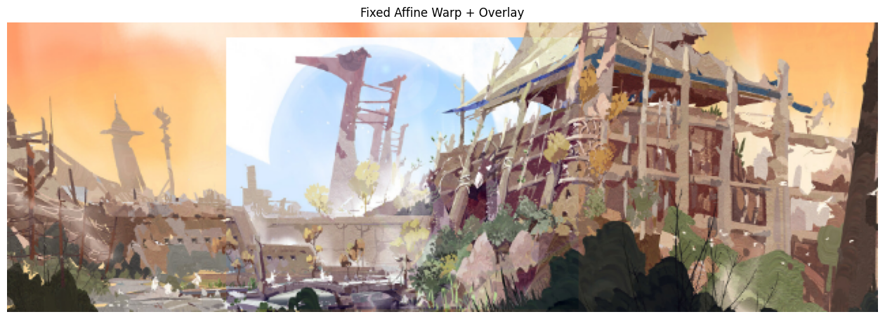
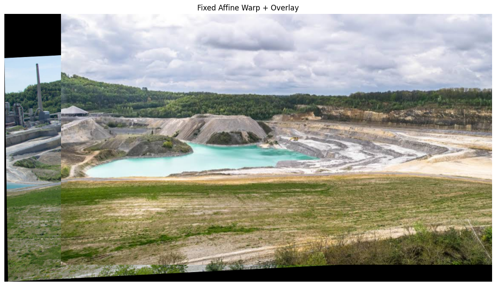
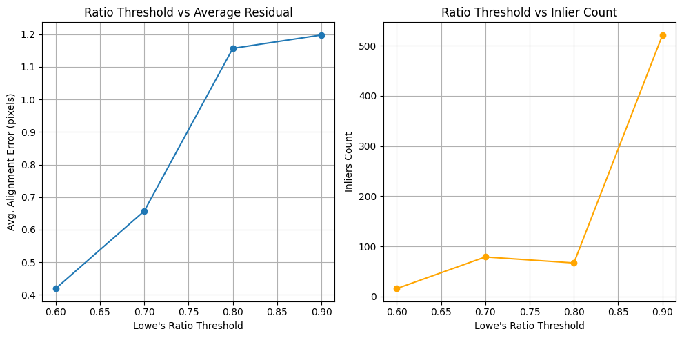

# Image Stitching using Harris + SIFT + RANSAC

This project implements a full image stitching pipeline using classical computer vision techniques:

- Harris Corner Detection
- SIFT Descriptor Extraction
- Descriptor Matching with Normalized Correlation & Euclidean Distance
- Match Filtering via Lowe’s Ratio Test
- Affine Transformation Estimation using RANSAC
- Warping and Overlay-based Stitching on a Shared Canvas

Developed in Python using OpenCV and NumPy.  
Final evaluation includes qualitative results across diverse image categories and a parameter sensitivity analysis.

---

## 🖼️ Sample Results

### ✅ Successful Stitch (Stylized Illustration)



- 159 matches retained after ratio test @ 0.8
- All 159 confirmed as RANSAC inliers
- Avg. residual: 0.14 pixels  
- Seamless visual alignment across cartoon-style architectural edges

> 🎨 Illustration used with credit to [Maojin.Lee on ArtStation](https://www.artstation.com/maojin_lee/albums/1658825).  
Displayed for non-commercial, educational purposes only.

---

### ❌ Challenging Case (Sint-Pietersberg Trail)



- Retained matches: 398 after ratio test @ 0.8  
- Avg. residual: 2.68 pixels  
- Large terrain variation + weak keypoint correlation  
- Failure due to parallax and repetitive textures

> 📷 Image source: Google Maps © imagery. Displayed for algorithm testing and educational use only.


---

## 📊 Parameter Sensitivity

### Ratio Threshold vs. Residual / Inlier Count



- Trade-off identified around 0.7–0.8  
- Lower ratio = cleaner matches, higher precision  
- Higher ratio = more inliers, more residuals

---

## 🧪 Experiments on Image Types

| Image Pair                  | Matches | Inliers | Avg Residual | Outcome         |
|-----------------------------|---------|---------|--------------|------------------|
| Natural Scene               | 248     | 247     | 1.01 px      | ✅ Good Stitch    |
| Sint-Pietersberg            | 398     | —       | 2.68 px      | ⚠️ Weak Match     |
| Mount Fuji + Taranaki       | 287     | —       | 3.10 px      | ❌ Poor Alignment |
| Van Gogh’s Starry Night     | 500     | 500     | 0.00 px      | ✅ Perfect        |
| Google Maps                 | 124     | —       | 2.69 px      | ❌ Failed         |
| Cartoon Buildings           | 159     | 159     | 0.14 px      | ✅ Excellent      |

---

## 🧠 Methodology Overview

### 1. Keypoint Detection
- Harris corner detector
- Threshold tuning @ 0.04–0.06
- Final threshold: 0.05

### 2. Descriptor Extraction
- Custom pipeline with SIFT descriptors
- Patch size: 5×5, 9×9, 15×15
- L2-normalization

### 3. Descriptor Matching
- Cosine similarity & Euclidean distance
- Ratio test @ 0.6–0.9
- Final: 0.8

### 4. Affine Transformation
- Custom RANSAC (1000 iterations)
- Inliers: reprojection error < 3 px
- Residual: mean squared error across inliers

### 5. Stitching & Overlay
- Affine warp + canvas translation
- No blending (preserves edges)

---

## ⚠️ Limitations

- Matching fails under large color/texture variations
- SIFT not resilient to symbolic projections or cartoon styles
- Limited robustness to scale and orientation if too extreme

---

## 🚀 Future Work

- Replace handcrafted features with learning-based descriptors (e.g. SuperPoint)
- Semantic-aware filtering of matches
- Homography or TPS warp instead of affine only
- Blending (feathering or Poisson) to improve visual continuity

---

## 📂 Project Structure
```
image-stitching/
├── main.ipynb         # End-to-end Harris + SIFT + RANSAC pipeline
├── results/           # Graphs and evaluation visualizations
├── figures/           # All stitched results and original input images
├── README.md          # Project description and usage guide
└── requirements.txt   # Python dependencies
```

---

## 📬 Contact
Maintained by [Hank Song](https://github.com/HANKSOONG)  
Originally developed as a Master's assignment at Maastricht University.
